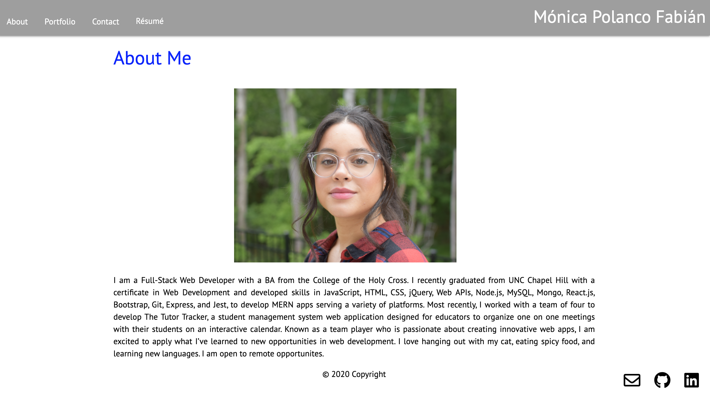

# Monica's Portfolio

## Description

My portfolio is where you can find my latest projects, my resume and information about me.

## Table of Contents

* [Usage](#usage)

* [Questions](#questions)

## Usage

https://mpolan16.github.io/monicas-portfolio/

The tools I used for this project included React.js, JavaScript, JSX, HTML, CSS, Node.js, Materialize, Font Awesome, and BootStrap.

## Questions

Mónica Polanco Fabían | 
MonicaPolancoFabian15@gmail.com